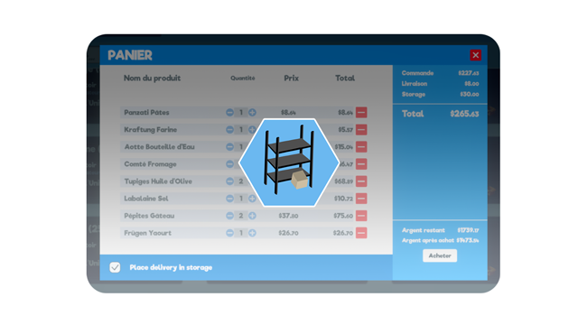

# StoreDelivery - Supermarket sim. mod

StoreDelivery is a mod for Supermarket Simulator which adds an option to place product boxes on racks in storage right after being purchased and delivred. To work, racks must have a product label.



## How it works

Go on the market app on the store computer, add some products to your cart then click on the cart button to open the purchase window. On the purchase window you have a checkbox with the label `Place delivery in storage`. If it's checked, additional fees will be applied to your order and all products in your order that can be placed on a rack with a matching label, will be placed on instantly after being delivred.

Fees cost are calculated based on the number of product boxes in your delivery, this can be changed in the mod configuration file.

If a product doesn't have place in storage the box will appear in front of the store as usual but you will still have to pay the fees for this box.


## Installation


### Requirements

- Compatible version of Supermarket Simulator
- BepInEx 5.x ([download](https://github.com/BepInEx/BepInEx/releases) and [installation guide](https://docs.bepinex.dev/articles/user_guide/installation/index.html))


### Steps

- Install BepInEx 5 on the game if you don't already have it.
- Download the latest release of the mod compatible with your game version in [release section](https://github.com/Eryux/supermarketsim-storedelivery/releases).
- Extract the archive and copy the `BepInEx` folder in the game root folder `%steamapp%\common\Supermarket Simulator`. If it asks you to replaces files, say yes to all.
- Launch the game, go to the computer > Market application > Open your cart then if you have a checkbox at the bottom of the cart window with the text "Place delivery in storage", the mod is successfully installed.


### Configuration

Mod configuration is available in `config/tf.bark.sms.StoreDelivery.cfg`. The change will apply after restarting the game.

```toml
[StoreDelivery]

## Enable StoreDelivery Plugin
# Setting type: Boolean
# Default value: true
enabled = true

## Apply fees when delivery is stored
# Setting type: Boolean
# Default value: true
fees_enables = true

## Fees added for each product box in your delivery
# Setting type: Single
# Default value: 3
fees_per_boxes = 3
```


## Troubleshooting

If you encounter a bug, please report it in [issues section](https://github.com/Eryux/supermarketsim-storedelivery/issues) on the official [github repository](https://github.com/Eryux/supermarketsim-storedelivery/) from the mod.

### Incompatibility with other mods

The mod act on cart window, cart cost, purchase and delivery. If you have other mod acting on one of those or more it can cause some incompatibility. If an incompatibility is detected with other mods it will be listed here.


## Building

### Requirement

- .NET SDK 7.0.407
- Marker simulator installed

### Steps

- Clone the repository on your machine.
- Open the `StoreDelivery.csproj` file with a text editor and edit the path `HintPath` from `Reference` tags to match your game installation directory.
- Open a terminal and run the command :
```
dotnet build --no-self-contained -c Release
```

## License

GPLv3 License